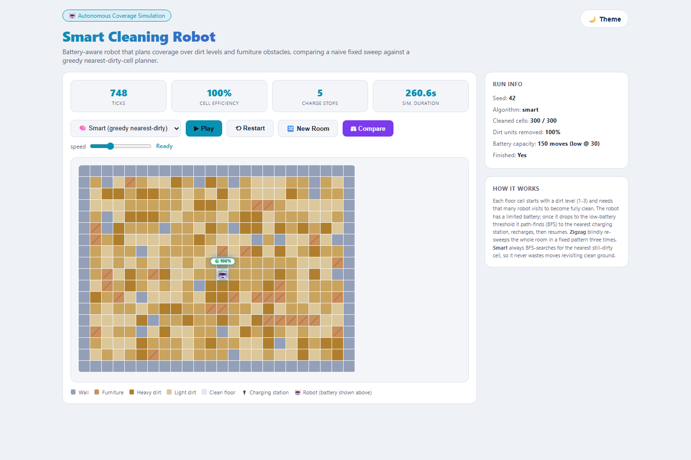

# Smart Cleaning Robot


> A battery-aware autonomous cleaning robot simulator. It generates a room with walls, furniture, and per-cell dirt levels, then compares a naive zigzag sweep against a BFS-driven "smart" planner — live, animated, in the browser.



## Why This Exists

Most cleaning-robot demos either fake the intelligence or skip the constraints that make coverage planning hard in the first place — obstacles, uneven dirt, and a battery that runs out mid-job. This project simulates all three and measures, with real numbers, how much a greedy nearest-dirty-cell planner actually saves over a robot that just sweeps blindly in rows.

## Features

- Procedurally generated rooms — outer walls, scattered wall cells, and furniture blobs, with connectivity guaranteed via BFS so every dirty cell is always reachable
- Per-cell dirt levels (1-3) — a cell isn't clean until the robot has visited it that many times
- Realistic battery model — 150 moves per charge, automatic BFS pathing to the nearest charging station when battery runs low, then seamless resume of the interrupted cleaning goal
- Two path-planning algorithms to compare head-to-head: naive zigzag vs. BFS-greedy smart
- Live animated playback of the robot moving, cleaning, and charging cell by cell
- Side-by-side comparison mode (`/compare`) with step count, move count, charge stops, and time-saved summary
- Reproducible runs via seed, plus a "New Room" action to generate a fresh layout
- Light/dark themed, canvas-rendered grid UI with a battery-indicator robot icon

## How It Works

### The room

Each simulation generates an `18x24` grid (configurable) seeded for reproducibility:

- **Walls** (`W`) — outer boundary plus randomly scattered interior wall cells
- **Furniture** (`F`) — 1-2 cell blobs that block movement, distinct from walls
- **Charging station** (`C`) — placed on the floor cell closest to the room's center
- **Floor** (`D`) — every remaining passable cell gets a random dirt level from 1 to 3

Only the largest BFS-connected floor region is kept as cleanable space, so the robot (and the charging station) can always reach every dirty cell — no isolated pockets.

### The two algorithms

Both algorithms share the same battery and charging logic; the only difference is how the next target cell is chosen.

- **Zigzag (naive)** — computes a fixed boustrophedon (row-by-row, alternating direction) visiting order up front and walks it on a loop, regardless of what's actually still dirty. It keeps re-sweeping the whole room until every cell has been visited enough times.
- **Smart (BFS-greedy)** — at every step, runs a breadth-first search from the robot's current position to find the *nearest* cell that still has dirt on it, and heads straight there. Once a cell is fully clean, it immediately re-targets the next closest dirty cell.

### Battery and charging

The robot starts with a full battery (150 moves). Every move or clean action costs 1 unit. Once the battery drops to the low-battery threshold (30), the robot suspends whatever it's doing, BFS-paths to the nearest charging station, and charges over a fixed number of animation ticks. Its previous cleaning target is preserved (never discarded) and picked back up automatically once it's back at full charge.

### The result

Across comparison runs, the smart planner consistently finishes the same room in **42-55% fewer steps** than the naive zigzag sweep — because it never wastes moves re-walking already-clean cells and always closes the distance to the nearest remaining dirt, instead of finishing a fixed route it committed to in advance.

## Tech Stack

- **Backend:** Python 3.11, FastAPI, Uvicorn
- **Path planning:** breadth-first search (`collections.deque`) over a pure-Python grid — no external numerical libraries required
- **Templating:** Jinja2
- **Frontend:** vanilla JavaScript, HTML5 Canvas API for the grid/robot rendering, no frontend framework or build step
- **Containerization:** Docker (see `Dockerfile`)

## Run Locally

**Prerequisites**: Python 3.11+, pip

```bash
git clone https://github.com/ErdoganPeker/Smart-Cleaning-Robot.git
cd Smart-Cleaning-Robot/app

python -m venv .venv
.venv\Scripts\activate      # Windows
# source .venv/bin/activate   # macOS/Linux

pip install -r requirements.txt
python main.py
```

The server starts on **http://localhost:5010**. Open it in your browser, hit **Play** to watch the robot clean, or **Compare** to run both algorithms on the same room side by side.

### API endpoints

| Endpoint | Description |
|----------|-------------|
| `GET /` | Serves the interactive UI |
| `GET /simulate?algo=smart&seed=42` | Runs a single simulation (`algo` is `smart` or `zigzag`) and returns the full step-by-step path as JSON |
| `GET /new?seed=&algo=` | Generates a fresh room (random seed if omitted) and simulates it |
| `GET /compare?seed=42` | Runs both algorithms on the same room and returns a comparison summary |

### Run with Docker

```bash
docker build -t smart-cleaning-robot .
docker run -p 8000:8000 smart-cleaning-robot
```

The containerized app listens on port `8000` (see `Dockerfile`).

## Author

**Erdogan Yasin Peker** — Computer Engineer

[GitHub](https://github.com/ErdoganPeker) · [LinkedIn](https://www.linkedin.com/in/erdogan-yasin-peker-b107ba24b/)
